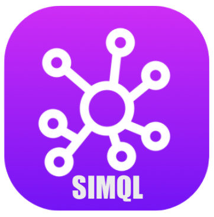

# SIMQL README

SIMQL is a domain specific langauge for the DQCar Eco-System, build to improve better efficensies for MetaMeasurepoint Designer

What's included in this SIMQL-Extension. Please refere to [ReleaseNotes](#release-notes)

Learning more about this [SIMQL-Extension](#extension-settings)

You need more about BCBS239? Please check [BCBS](#bcbs-239-general-introduction)

You need a SIMQL-Documentation? Please refere to [SIMQL-DOC](#simql-dsl-language)

## Features
- implementing a MetaMeasurementPoint (MMP) written in SIMQL
- Using Design-Snippets for an easy progress
- SIMQL(Code) Syntax-Highlighting for better reading
- Building a running MetaMeasurementPoint (MMP) converted into Python
- 

## Extension Settings

### Extension Commands

### Extension Tasks

### 

## Known Issues

Calling out known issues can help limit users opening duplicate issues against your extension.

## Release Notes

### SIMQL 0.6.0 (2023-09)
initial setup for SIMQL 0.6.0 and the VSCode Extionsion

---

# Confluence-Documentations
## BCBS 239 general introduction
[BCBS239 in a Nutshell]()

## SIMQL DSL Language
[SIMQL in a Nutshell]()

## Measurements, MetaMeasurements, Rules
[MP, MMP, RULES]()

**Enjoy!**
